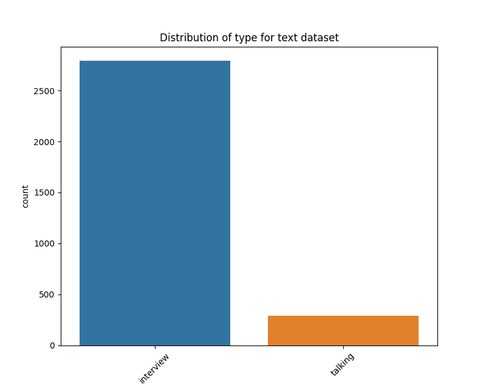
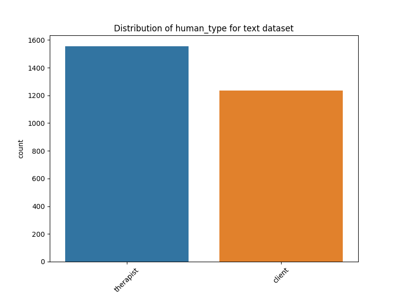
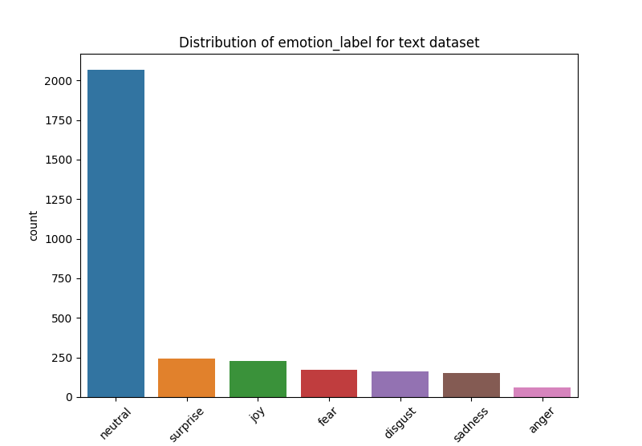
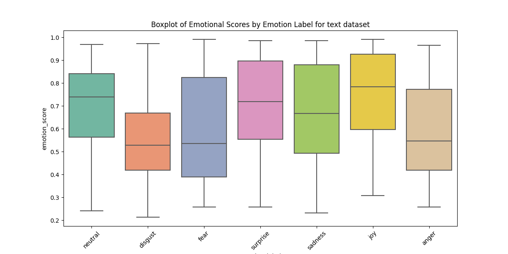
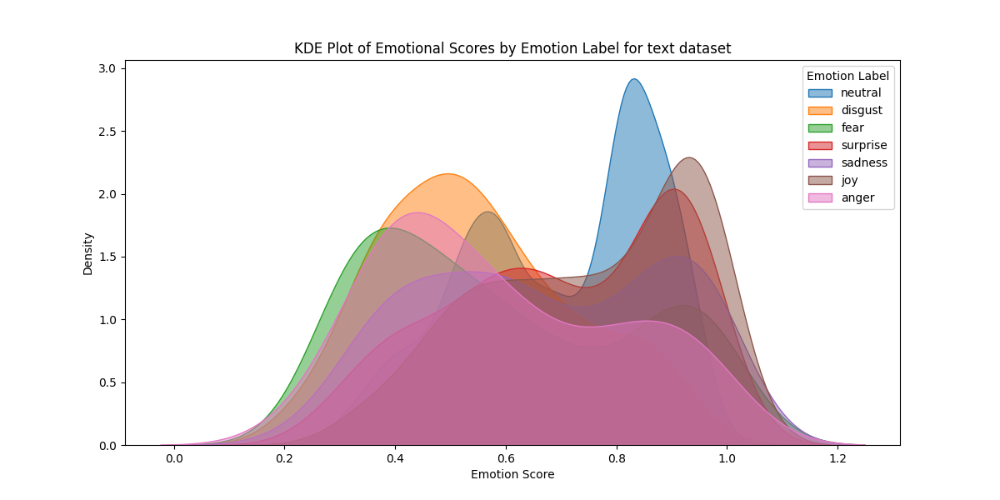
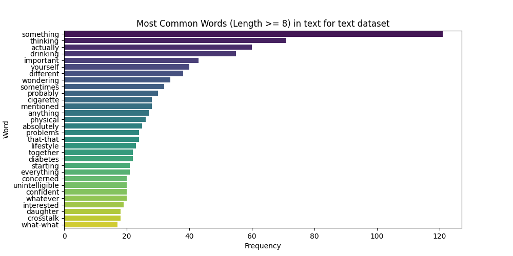
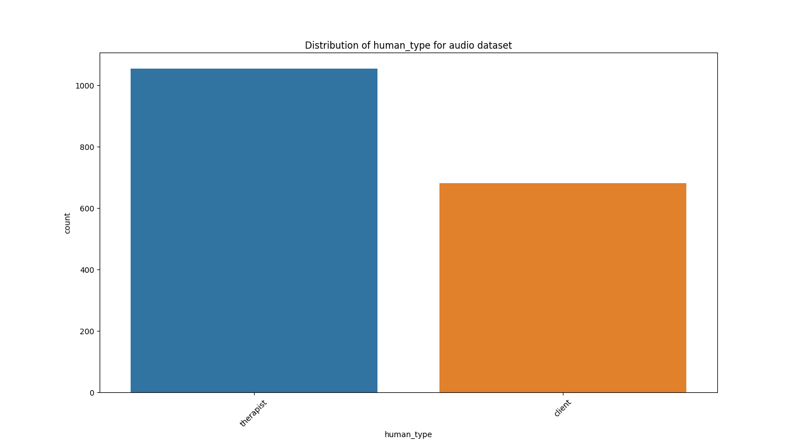
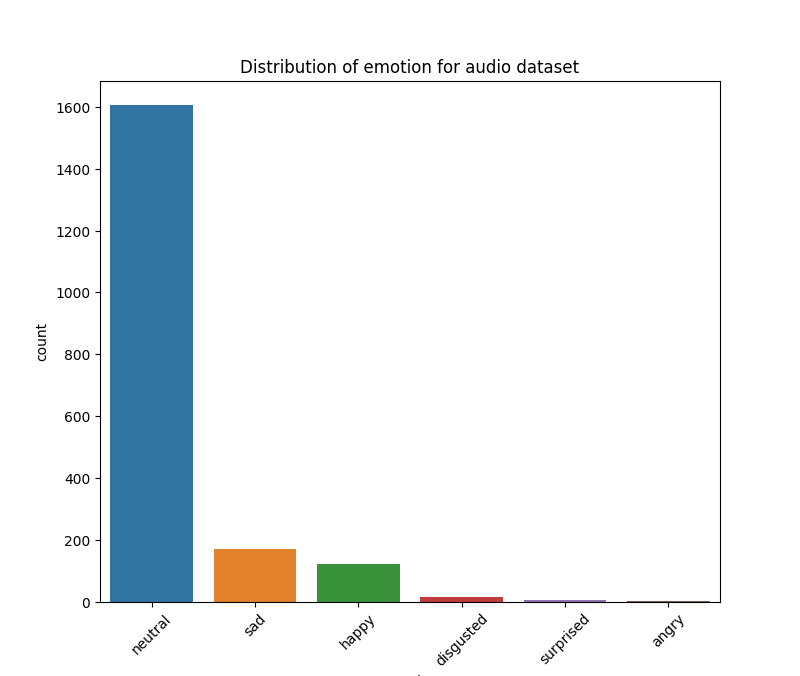

# Text and Voice Dataset from Elders in Health and Elder Care Settings

Here is a repo for my AIPI510 Final Dataset. It is an Text and Voice Dataset from Elders in health and elder care settings. The Dataset is opensourced on Kaggle wbesite. https://www.kaggle.com/datasets/billyae/text-and-audio-dataset-for-elder-care-settings

## Executive Summary

### Backgrounds

- Healthcare for elders is paid more and more attention and there is growing market in elder targeted health care.
- The number of empty nests and elders with busy sons and daughters are growing in this fast pace society.
- Though healthcare companies released health care applications including basic health tests and health records for elder's relatives to learn their physical conditions, it is hard to give them emotional companionship.
- Develop a healthcare AI Chat bot which could simulate elder's voice and chat with empty nest elders in elder care or health care settings to give emotional cares for elders and provide elder care support, in a tone of an elder to make that empty nest elders feel talking with their old friends.

### Motivation

To train such a healthcare AI chatbot which could simulate elder's voice and chat with elders in elder care or health care settings, I need to collect conversation voice and conversation text spoken by elders. In addition, to provide emotional care for elders, the AI chatbot should know the emotion status in each conversation text and conversation voice segement. For this motivation, I collected 2 datasets, one of which contains conversation voice spoken by elders and the other contains conversation text spoken by elders in interviews or talkings in healthcare settinigs. All of the conversation text or voice entries are labeled with emotional status.

### Potential Applications

- It could be used to train a healthcare AI chatbot which could simulate elder's voice and chat with elders in eldercare or health settings.  
- It could be used to learn the voice and conversation patterns of elders so that machine might leverage those patterns to better understand what elder's saying and their emotions.

## Power Analysis

To know how much data I should collect, the power anlaysis helps. To estimate the sample size and to estimate the sample size, it is a must to know the following things:   
    
(1) Expected effect size.    
(2) Statistical significance level.   
(3) The statistical method that will be used to test the null hypothesis.    
(4) Power.   

For this specific task, the classification task is whether the conversation text or the conversation audio is from an elder. So the sample size in each group to be tested based on the power analysis is the number of entries I should collect. ( Another same number of entries of conversation text or audio not from elders could help the model classify if the conversation text or audio is from an elder. But for this dataset it only contains the conversation text and audio from elders, so I should collect that number of entries. )   

For the audio data, for the effect size, based on Cohen's calculation, I choose d=0.063 as effect size to make it highly sensitive to detecting subtle differences. And normally, I set the statistical significance level as 0.05. And I use the power as 80%, a typical value. The statistical method to be used to test the null hypothesis is t-test. After the calculation, the sample size should be 2000.    

For the text data, for the effect size, based on Cohen's calculation, I choose d=0.051 as effect size to make it highly sensitive to detecting subtle difference. (more sensitive becuase text is hard than audio to find the difference) And normally, I set the statistical significance level as 0.05. And I use the power as 80%, a typical value. The statistical method to be used to test the null hypothesis is t-test. Adter the calculation, the sample size should be 3000.

After the power analysis, I should collect **2000** conversation audio entries and **3000** conversation text entries for my dataset.    

## Dataset Description

### Conversation Text Dataset

This dataset contains all conversation text data spoken by elders in health and eldercare settings. Here is all the columns of this dataset.  
- **conversation id**: Identify the conversation in which the conversation texts happened. For example, if two entries have the same value of conversation id, they are from the same interview or talking.   

- **text**: The content of the conversation text from elders.     

- **type**: The class of the conversation, including interview and talking.  

- **human_type**: The role in the conversation. If it is an interview, it classifies if the conversation text is from a client or a therapist. If it is a talking, it is empty value.   

- **video_url**: The url of the original video for this text.    

- **text_id**: The id of the conversation text in each conversation. For example, if two entries have the same value of conversation id, they are from the same interview or talking but they are different with the text_id in this conversation. Specially, ( conversation_id,text_id ) forms a unique text entry.     
  
- **emotion_label**: The emotion of the text based on the analysis, including neutral, surprise, joy, fear, disgust, sadness and anger.    

- **emotion_score**: To what extent the emotion of this text is related to the emotion_label. The higher the score is, the more related the emotion is to the emotional label.  

### Conversation Audio Dataset

The dataset contains all conversation audio data spoken by elders in health and eldercare settings. Here is all the columns of the dataset.  

- **conversation id**: Identify the conversation in which the conversation audio happened. For example, if two entries have the same value of conversation id, they are from the same interview or talking.   

- **audio_path**: The audio path of the conversation voice from elders. My dataset including all audio data I collected has been uploaded to kaggle so the path is related to the audio data on the kaggle. The audio_client, audio_speaker and audio_therapist folders are uploaded as sub compressed package. For example, after you extract all the files in the audio_client.z01, audio_client.z02 and audio_client.z03 and merge them to the folder named audio_client, you can get the file based on the audio_path value of each entry in this conversation audio dataset.    

- **type**: The class of the conversation, including interview and talking.    

- **human_type**: The role in the conversation. If it is an interview, it classifies if the conversation text is from a client or a therapist. If it is a talking, the value is empty.    

- **video_url**: The url of the original video for this audio.    

- **emotion**: The emotion of the audio based on the analysis, including neutral, sad, happy, disgusted, surprised and angry.

## EDA
### Conversation text Dataset
#### Summary

There is 3080 rows and 8 columns for this dataset. The numerical columns are conversation_id, text_id and emotional_score. The categorical columns are text, type, human_type, video_url, emotion_label. 

#### Missing Values, Duplication 

There is no missing values for all the columns except the human_type. The human_type column has 288 values missing because they are entries retrieved from talkings from elders not one-to-one health interviews. So there is no need to be labeled as client or therapist for those entries. 

There is no duplicate row in the Conversation text Dataset.  

#### Categorical Feature Analysis

**Type feature:**      

Based on the EDA results, there is 2792 entries collected from interviews and 288 entries collected from talkings as a complement. The proportion of the entries collected from an interview is 91% and the proportion of the entries collected from an interview is 9%. It shows the most of my dataset is collected from interview but I choose to add some talkings as implement to make this dataset containing some data in health and eldercare settings and add its diversity.  

**Human Type:**     
      

Based on the EDA results, there is 1556 entries collected from interviews in which the speaker is a therapist and 1236 entries collected from interviews in which the speaker is a client. The proportion of the entries collected from an interview in which the speaker is a therapist is 56% and client is 44%. It shows the text data from client and therapist is more balanced and due to the different speaking pattern between client and therapist, based on the this label, the model handling this data could get more useful information to learn the pattern of elder conversation text data.   

**Emotion_label:**   
         

Based on the EDA results, there is 2067 entries in which the emotion of the text is neutral, 241 are surprise, 225 are joy, 173 are fear, 162 are disgust, 153 are sadness and 59 are anger. Though there is a variety of the emotion status in this dataset, the majority is the neutral, it might because elders have gentle personality and their words typically are neutral in nature. 

#### Numerical Feature Analysis
**Emotional Score:**   
        

Based on the EDA results, we could see that for the texts with neutral, surprise and joy emotions, their emotions are highly related to the labled emotion status because the emotional_score is high in average. But for the texts with disgust, fear and anger emotions, their emotions are not highly related to the labeled emotion status because the emotional_score is comparably low. The model to be trained could use this value to judge if the emotion is intense of this status and this data could be used to learn the detailed emotional pattern. 

#### Text Analysis

To know what words elders are likely to say in elder care settings and health settings. I counted the top30 common words (length>=8 to prevent modal particles) in all my words of my conversation text dataset. From the result of EDA, some specific words such as that-that, what-what might reflect the pattern of talking of elders. And there are some other words which are related to health care settings such as drinking, cigarettte, physical, problems, lifestyle, diabetes. And those words might be some common words in elder care settings and are helpful for training a AI chatbot targeted at healthcare problem.

### Conversation audio Dataset

#### Summary
        
There is 1948 rows and 6 columns for this dataset. The numerical columns are conversation_id, and text_id. The categorical columns are audio_url, type, human_type, video_url and emotional_label. 

#### Missing Value and Duplication
       
There is no missing values for all the columns except the emotion and human_type columns. The human_type column has 214 values missing because they are entries retrieved from talkings from elders not one-to-one health interviews. So there is no need to be labeld as client or therapist for those entries. And the missing values for the emotion is because the pre-trained DL model ( SenseVoiceSmall ) cannot recognize the emotion of the audio file. 

THere is no duplicate row in the Conversation audio Dataset.

#### Categorical Feature Analysis

**Type Feature:**    
       

Based on the EDA results, there is 1734 entries collected from interviews and 214 entries collected from talkings as a complement. The proportion of the entries collected from an interview is 89% and the proportion of the entries collected from an interview is 11%. It shows the most of my dataset is collected from interview but I choose to add some talkings as implement to make this dataset containing some data in health and eldercare settings and add its diversity. The same as the conversation text dataset. 60
 
**Human Type:**    
          

Based on the EDA results, there is 1053 entries collected from interviews in which the speaker is a therapist and 681 entries collected from interviews in which the speaker is a client. The proportion of the entries collected from an interview in which the speaker is a therapist is 60% and client is 40%. It shows the audio data from client and therapist is more balanced and due to the different speaking pattern between client and therapist, based on the this label, the model handling this data could get more useful information to learn the pattern of elder conversation audio data.   

**Emotional Label:**    
        

Based on the EDA results, there is 1605 entries in which the emotion of the text is neutral, 169 are sad, 121 are happy, 14 are disgust, 4 are surprised and 2 are angry. Though there is a variety of the emotion status in this dataset, the majority is the neutral and the proportion of neutral is as high as 82%, it might because elders voices sound to be neutral in nature, which might be a pattern to recognize the voice of elders and could be a feature to be integrated in synthetic elder voice to simulate elder's emotion.

**Audio Data Analysis:**    
       
    

**Dominant Frequency Range**: This histogram shows the distribution of mean frequency of each audio file. Based on this histogram. The majority of the mean frequencies lie in the range of 2000Hz to 3500Hz, which corresponds to a typical range of human speech and is consistent with the focus on elder conversations.        
      
**Distribution Shape**: It shows a right-skewed distribution, indicating that thought most audio files are in the 2000-3500 Hz range, there are some files with higher mean frequencies extending beyond 4000Hz.      
       
**Outliers**: Few audio files show mean frequencies in the range of 5000-7000, indicating that there might be presense of background noise or high-pitched content. And the minimal content exists below 1000Hz, which might be affected by environmental sounds or bass tones rather than human voice.     
      
**Elderly voice Patterns**: Elderly voice often has less energy in higher frequencies due to natural age-related changes in vocal cords and articulation. This may explain the clustering around 2000-3500 Hz and the gradual decline in frequencies above 4000 Hz.      
    
## Data Soucring

The Data Sourcing public Repo is here: https://github.com/billyae/AIPI510-Final-Project/    

## Bias

Here are some potential biases for this dataset.   

**Demographic Representation**: The dataset focus on elders in healthcare and elder care settings, which might not capture the diversity of elders in different social, cultural or geographic contexts because most of the speakers are from U.S. This could lead to biases when training model on this dataset and test on a broader population.    
     
**Labeling Bias**: The emotional labeling of text is from j-hartmann/emotion-english-distilroberta-base pretrained model on huggingface. And the emotional labeling of audio is from SenseVoice model. Those model could have bias for the emotion prediction itself so the labeling result of the dataset might contain bias.    
      
**Data Source Bias**: Because most of the data are from interviews in health settings and only a small portiono of the data are from talkings about elder care settings, the dataset might over-represent interview scenarios and it might not reflect real-world spontaneous interactions.      
       
**Health Condition Representation**: The health condition of the speakers in the dataset might not cover all health conditions, which might lead the model trained on this dataset behaving like elders with some specific health conditions and cater for the elders who need a AI chatbot "friend" with other health conditions.   

## Ethics Statement

This project is committed to upholding ethical standards in data collection and use. All data will be sourced from publicly available, open-source datasets or collected with explicit consent from participants. Privacy and confidentiality will be maintained by anonymizing personal identifiers, and the data will only be used for the stated purposes of improving elder-care chatbot interactions. The project will comply with all applicable ethical guidelines, including respect for the autonomy, dignity, and rights of elderly individuals. Additionally, no sensitive or private data will be used without proper permissions, ensuring the protection of participants' well-being.   

The data collection was approved by one of an Duke Campus IRB member Melissa Beck. After the reviewing the information went and in consultation with members of Campus IRB team, it has been determined that this project does not meet the definition of research with human subjects and will not require IRB submission or review.   

## Opensource License   

MIT License

Copyright (c) [2024] [Zihao Yang]

Permission is hereby granted, free of charge, to any person obtaining a copy of this software and associated documentation files (the "Software"), to deal in the Software without restriction, including without limitation the rights to use, copy, modify, merge, publish, distribute, sublicense, and/or sell copies of the Software, and to permit persons to whom the Software is furnished to do so, subject to the following conditions:

The above copyright notice and this permission notice shall be included in all copies or substantial portions of the Software.

THE SOFTWARE IS PROVIDED "AS IS", WITHOUT WARRANTY OF ANY KIND, EXPRESS OR IMPLIED, INCLUDING BUT NOT LIMITED TO THE WARRANTIES OF MERCHANTABILITY, FITNESS FOR A PARTICULAR PURPOSE AND NONINFRINGEMENT. IN NO EVENT SHALL THE AUTHORS OR COPYRIGHT HOLDERS BE LIABLE FOR ANY CLAIM, DAMAGES OR OTHER LIABILITY, WHETHER IN AN ACTION OF CONTRACT, TORT OR OTHERWISE, ARISING FROM, OUT OF OR IN CONNECTION WITH THE SOFTWARE OR THE USE OR OTHER DEALINGS IN THE SOFTWARE.

 

